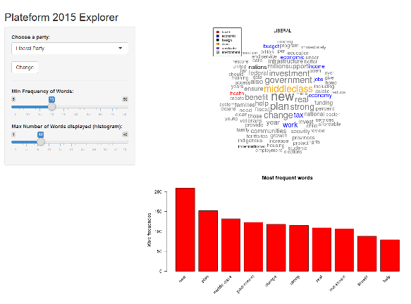

## The inspiration


On October 19th, Canadians had to renew their parliament. One week before the elections, all main political parties released their platforms. About 400 pages of political promises to read to make a choice in only 1 week!

So I decided to do a Shiny App which analyses the platforms' text.

The App should have:

1. a word cloud with the words size corresponding to the frequency and color highlighted according to the topic
2. a frequency histogram to see the frequency values of the words

--- .class #id 

## How it works...

Let's take the few first lines of elected party's platform (Liberal)

```r
library(tm)
mytext <- readLines("liberal.txt", encoding="UTF-8", skipNul = TRUE, n= 50)
mytext <- gsub("middle class", "middle~class", mytext)
# Load the data as a corpus
docs <- Corpus(VectorSource(mytext))
# Convert the text to lower case
docs <- tm_map(docs, content_transformer(tolower))
# Remove numbers
docs <- tm_map(docs, removeNumbers)
# Remove english common stopwords
docs <- tm_map(docs, removeWords, stopwords("english"))
# Remove punctuations
docs <- tm_map(docs, removePunctuation)
# Eliminate extra white spaces
docs <- tm_map(docs, stripWhitespace)
```

--- .class #id 

## The results


```r
dtm <- TermDocumentMatrix(docs)
m <- as.matrix(dtm)
v <- sort(rowSums(m),decreasing=TRUE)
d <- data.frame(word = names(v),freq=v)
head(d,5)
```

```
##                  word freq
## canadians   canadians    3
## open             open    3
## strong         strong    3
## fair             fair    2
## government government    2
```

The frequency of words is visualized on a word cloud and an histogram in the App. You can choose the party, the minimum frequency and the number of words to display with the histogram!

--- .class #id 

## Give it a try!




[Try the App!](https://solange.shinyapps.io/projectApp)


<!-- Limit image width and height -->
<style type='text/css'>
img {
    max-height: 560px;
    max-width: 964px;
}
</style>

<!-- Center image on slide -->
<script src="http://ajax.aspnetcdn.com/ajax/jQuery/jquery-1.7.min.js"></script>
<script type='text/javascript'>
$(function() {
    $("p:has(img)").addClass('centered');
});
</script>
